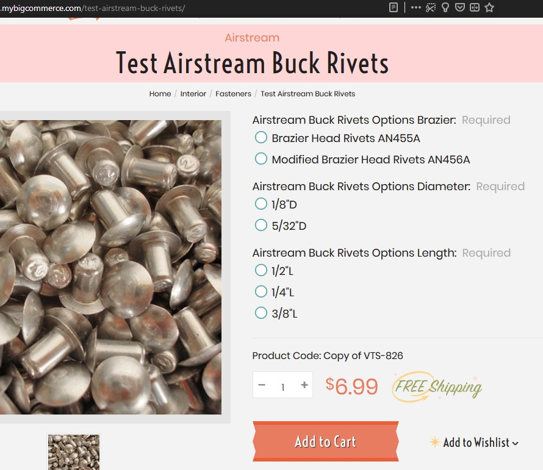
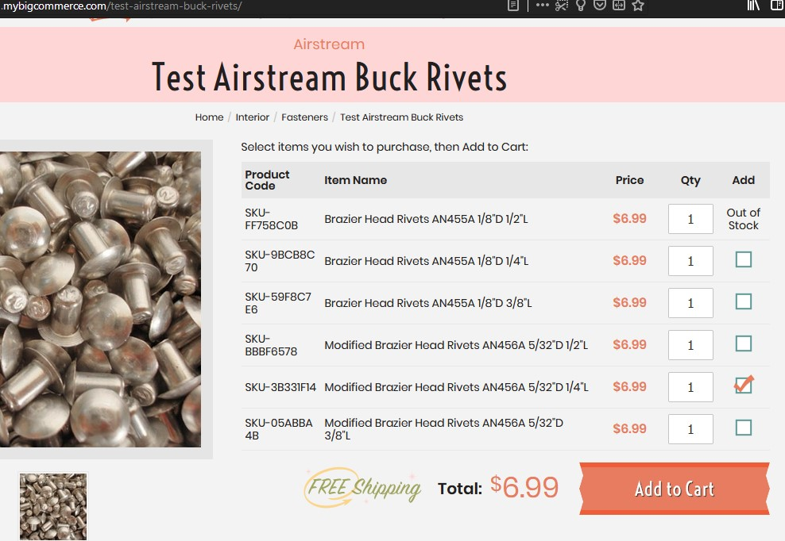

# BigCommerce Multi-Child Products

Provides a way to change default required options layout on product page into a table of all available combined options.

## Getting Started

First, add the package (for example using npm) with `npm install bigcommerce-multi-child-products`.

Then, on your (custom) product template create or use a `<div>` element (we use the CSS class `js-multichild` but can be anyone you want) which is going to be used as the container for the Vuejs component.

On the product template you can also hide (or remove) the Add to Cart button since the component adds its own in order to add to cart more than one product at a time.

Also, on your (custom) template you can add a CSS class like `js-multichild-product-view` on your productView `<div>` element in order to pass it as the scope for the VueJs component.

Now on product.js file you can import the package passing the scope which is a jQuery object (since jQuery is already imported by BigCommerce). Also, you need to pass the `context` object with product `options` and `product_id` (injected from your template) along with all text that can be injected from your language file through your template. Later we'll show an example of how to inject this data but for now, these are the language properties to be passed to the `context` object:

- langCurrencyToken -> this comes from `settings.money.currency_token`
- langSelectItems
- langProductCode
- langItemName
- langQty
- langPrice
- langAdd
- langTotal
- langAddToCart
- langAddingToCart
- langOutOfStock

Last, you need to remove the default way BigCommerce render options, which is inside `<div data-product-option-change>` element. Do not remove this element tho, since this is needed by BigCommerce (it listens for options changes which are not needed here).

These are the steps to start, please check the example below to enlight more these steps.

### Prerequisites

Nodejs v10+ (we assume you have installed something like nvm for changing Node versions).

Have a valid `.stencil` file as documented [here](https://developer.bigcommerce.com/stencil-docs/getting-started/running-stencil-locally/authorizing-and-initializing).

## Example

Once installed the package, we add the text on the language file like this (_en.json_):

```json
{
    ...,
    "multichild_product": {
        "select_items": "Select items you wish to purchase, then Add to Cart:",
        "product_code": "Product Code",
        "item_name": "Item Name",
        "price": "Price",
        "qty": "Qty",
        "add": "Add",
        "total": "Total:",
        "add_to_cart": "Add to Cart",
        "adding_to_cart": "Adding to Cart...",
        "out_of_stock": "Out of Stock"
    }
}
```

We need to inject this text into the context object, one way to do this is to create a template like _template/components/custom/product/multichild-product-lang.html_

```html
{{inject 'langCurrencyToken' settings.money.currency_token}}
{{inject 'langSelectItems' (lang 'multichild_product.select_items')}}
{{inject 'langProductCode' (lang 'multichild_product.product_code')}}
{{inject 'langItemName' (lang 'multichild_product.item_name')}}
{{inject 'langPrice' (lang 'multichild_product.price')}}
{{inject 'langQty' (lang 'multichild_product.qty')}}
{{inject 'langAdd' (lang 'multichild_product.add')}}
{{inject 'langTotal' (lang 'multichild_product.total')}}
{{inject 'langAddToCart' (lang 'multichild_product.add_to_cart')}}
{{inject 'langAddingToCart' (lang 'multichild_product.add_to_cart')}}
{{inject 'langOutOfStock' (lang 'multichild_product.out_of_stock')}}
```

Now, we add this into our (custom) template and inject `options` and `product_id`, for example _template/components/custom/product/multichild-product-view.html_. We strip the content that remains the same on a "normal" productView template:

```html
{{> components/custom/product/multichild-product-lang }}

<div class="productView js-multichild-product-view">
    ...

    <section class="productView-details">
        <div class="productView-product">
            <h1 class="productView-title" {{#if schema}}itemprop="name"{{/if}}>Test view {{product.title}}</h1>
            ...
        </div>
    </section>

    <section class="productView-images" data-image-gallery>
        ...
    </section>

    <section class="productView-details">
        <div class="productView-options">
            {{#if product.release_date }}
                <p>{{product.release_date}}</p>
            {{/if}}
            <form class="form" method="post" action="{{product.cart_url}}" enctype="multipart/form-data" data-cart-item-add>
                <input type="hidden" name="action" value="add">
                <input type="hidden" name="product_id" value="{{product.id}}"/>
                    {{#each product.customizations}}
                        {{{dynamicComponent 'components/products/customizations'}}}
                    {{/each}}

                <div class="js-multichild">
                    {{inject 'options' product.options}}
                    {{inject 'product_id' product.id}}
                </div>

                <div data-product-option-change style="display:none;">
                    <!-- This content is removed -->
                </div>
                ...
            </form>
            {{#if settings.show_wishlist}}
                {{> components/common/wishlist-dropdown}}
            {{/if}}
        </div>
        {{> components/common/share}}
        {{{snippet 'product_details'}}}
    </section>

    <article class="productView-description"{{#if schema}} itemprop="description"{{/if}}>
        ...
    </article>
</div>
```

If we want to show our own free shipping section, let's say, we have on our normal template the next free shipping element:

```html
    {{#if product.shipping}}
        {{#if product.shipping.price.value '==' 0}}
            <div class="product-free-shipping">
                
            </div>
        {{/if}}
    {{/if}}
```

With the class name `.product-free-shipping` we tell the widget to render the free shipping element. The SVG inside points to `/content/icons/product-badge-free-shipping.svg` which is the same as in the normal shipping template above. This is just in case you want to render a free shipping inside the widget as shown in the example below.

Lastly, on _product.js_ we import and use the package:

```javascript
/*
 Import all product specific js
 */
import $ from 'jquery';
import PageManager from './page-manager';
import Review from './product/reviews';
import collapsibleFactory from './common/collapsible';
import ProductDetails from './common/product-details';
import videoGallery from './product/video-gallery';
import { classifyForm } from './common/form-utils';

export default class Product extends PageManager {
    onReady() {
        ...

        if (document.querySelector('.js-multichild-product-view')) {
            import('bigcommerce-multi-child-products')
                .then(multichild => multichild.default($('.js-multichild-product-view'), this.context));
        }
    }

    ...
}
```

That's it, you should be able to use the VueJs component

This is how a normal product page can look:



and this is how it looks with our custom template applied (styling can be inside the normal `productView.scss` file).



## Notes

When clicking the Add to Cart button, customer is redirected to the Cart page since there is no easy way to show the added products on the cart preview popup.

## Authors
* Hector Fernando Hurtado

## License

This project is licensed under the MIT License - see the [LICENSE](LICENSE) file for details

[](http://www.brandlabs.us/?utm_source=gitlab&utm_medium=technology_referral&utm_campaign=brandlabs-bigcommerce-multi-child-products)
